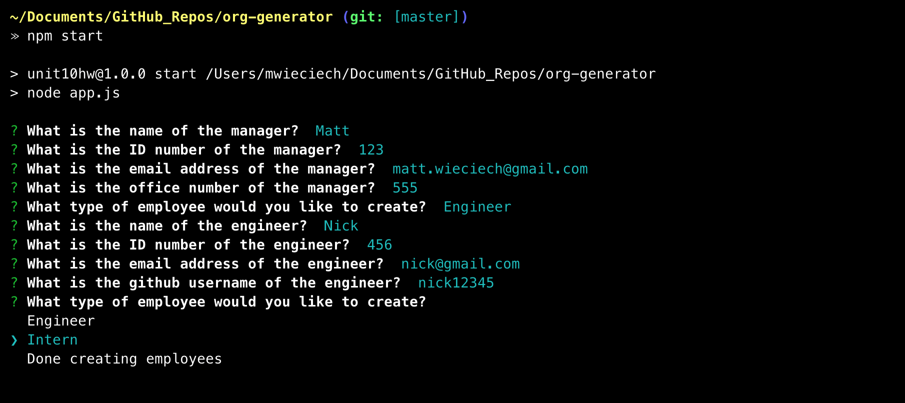
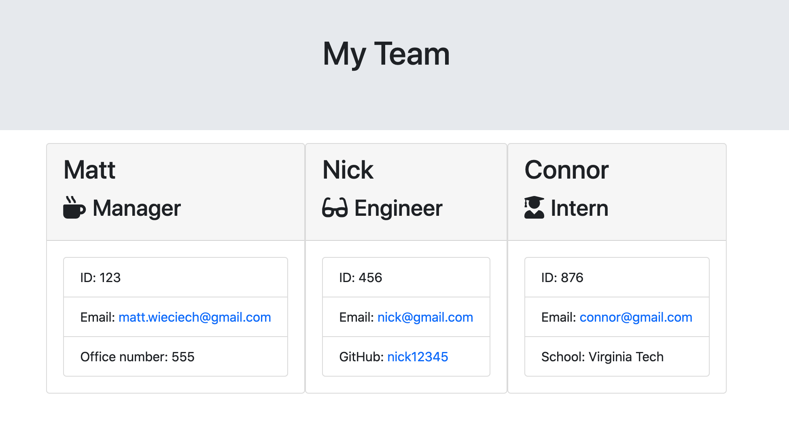

# Team Oranization Generator CLI

#### Created On: 07/25/2020  

## Description
CLI appliction built with node.js using inquirer and fs packages that allows the user to build a team with a Manager and as many Engineers and Interns as needed. The user is prompted to input information for each employee and when finished an HTML file is rendered that will display the full team and employee details. 
## Table of Contents
* [Installation](#installation)
* [Usage](#usage)
* [Tests](#tests)
* [License](#license)
* [Questions](#questions)

​  
​  

## Installation
1. Navigate to project directory from the command line
2. Run npm install
3. Run node
4. Follow intsructions and answer all questions regarding employee information
5. To exit the application select Done creating employees
6. Navigate to output directory
7. Newly rendered HTML file containing organization sturcture with employee details will be located inside of this directory

## Usage
This app should be used to build out a team organization structure rendered in HTML containing a Manager with any number of Engineers and Interns with individual employee information.

## Tests
Testing with jest, run npm test

## License
This project is convered under the MIT License.

## Questions
For questions about this project, please see my GitHub at [wheaties5588](https://github.com/wheaties5588), or reach out by email at matt.wieciech@gmail.com.